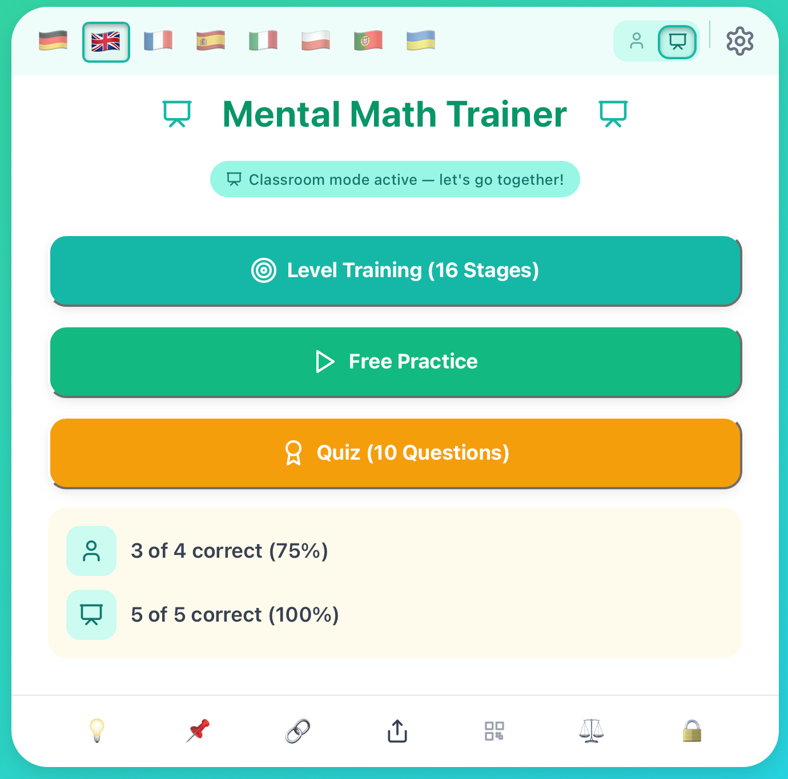
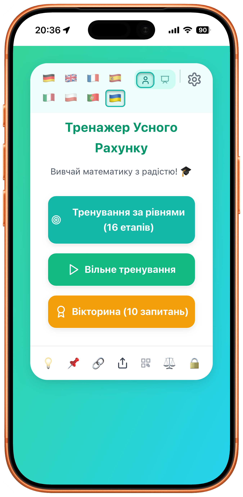
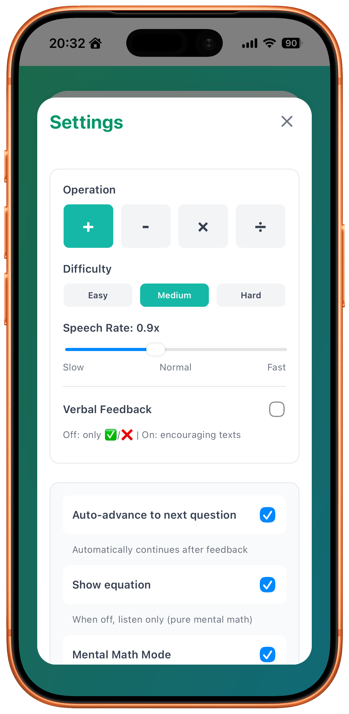
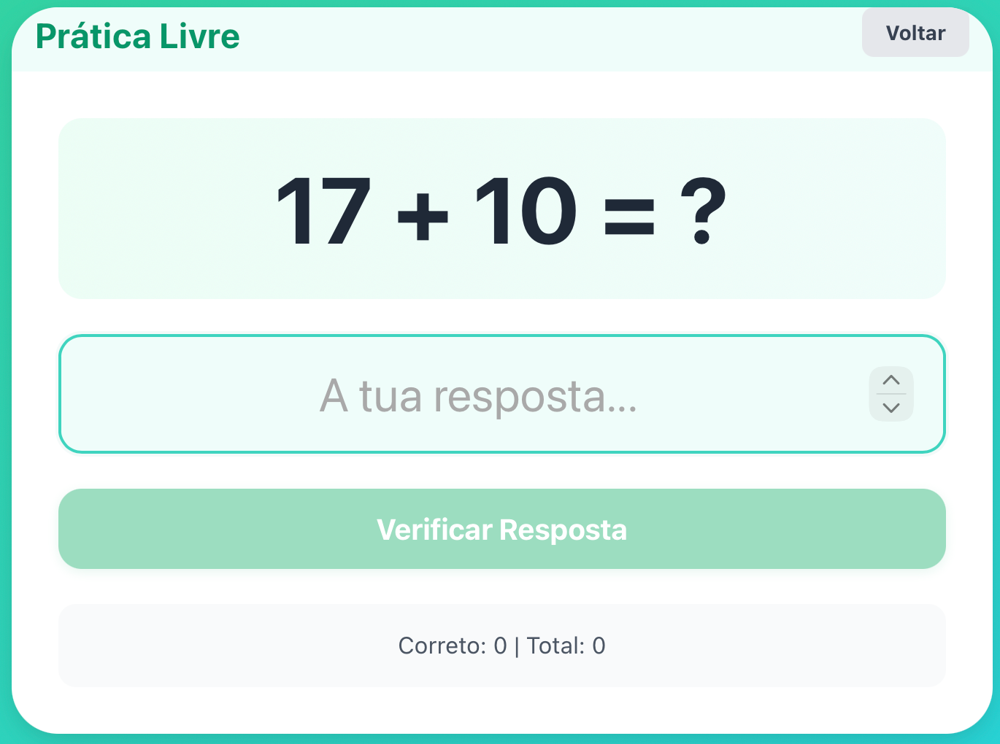

# MathEU — Mental Math for Europe

A free, multilingual mental math trainer for European primary school children.
No ads, no accounts, no tracking — everything stays on the device.

**Live:** https://matheu.eu

## What it does

The child hears or sees a problem — addition, subtraction, multiplication or
division — and answers. Three difficulty levels and a sixteen-stage path that
builds up gradually. One mode shows the equation on screen; another only reads
it aloud for pure mental math.

## Features

- **Four operations, three difficulties** and a 16-stage progression
- **Screen or audio-only** practice — read the problem, or solve it purely by ear
- **Classroom mode** — completely silent, so a whole class can practise at once
  without laptops talking over each other
- **One-tap sound toggle** — kids can mute or unmute themselves mid-practice,
  no need to open settings or ask a grown-up
- **Sober by default** — a green ✅ or red ❌ and nothing else; no fireworks, no
  inflated praise. Encouraging messages are opt-in
- **Daily counter**, split between individual and classroom use, so a parent or
  teacher can see today's practice at a glance. Resets each day, keeps no
  history, never leaves the device
- **Automatic language detection** — opens in the device's language
- **8 European languages**, private and free

## Screenshots

| Menu (Ukrainian) | Settings |
| --- | --- |
|  |  |

Free practice, showing the equation (Portuguese):

## Languages

🇩🇪 German | 🇬🇧 English | 🇫🇷 French | 🇵🇹 Portuguese
🇪🇸 Spanish | 🇮🇹 Italian | 🇵🇱 Polish | 🇺🇦 Ukrainian

The interface auto-selects the device language on first load and falls back to
English for unsupported locales. Language can always be switched by hand.

## Privacy

No accounts, no ads, no analytics, no data collection. Practice stats live only
in the browser's local storage on the device and are never sent anywhere.

## Tech stack

React 18 + Vite · react-i18next · Web Speech API (browser-native TTS) · CSS

## 🙏 Credits & inspiration

- [opdehost-kopfrechnen](https://github.com/Vaeshkar/opdehost-kopfrechnen) by [@Vaeshkar](https://github.com/Vaeshkar)
- Original pedagogical concept from Grundschule Op de Host

MathEU builds on their concept but was completely rebuilt from scratch.

## Developer

Werner Deuermeier ([@wdeu](https://github.com/wdeu))
